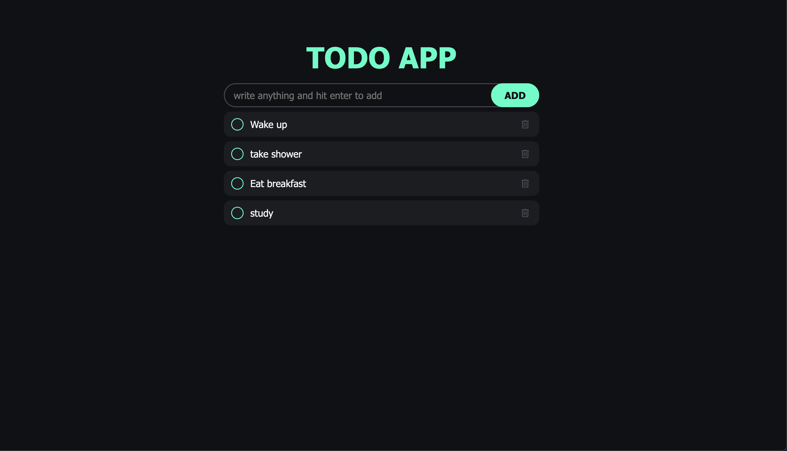

# ✅ To-Do List App

A fully responsive and functional To-Do List application built using **HTML**, **CSS**, and **JavaScript**.  
It features DOM manipulation for dynamic task handling, clean UI design with a custom color palette, and local storage to retain your tasks even after refreshing.

---

## 🎨 Features

- ➕ Add tasks with a clean input interface
- 🗑️ Delete tasks dynamically
- ✅ Mark tasks as completed using checkboxes
- 📦 Store tasks in **Local Storage** for persistence
- 📱 Fully responsive using **Flexbox**
- 🎨 Clean UI with a custom color palette

---

## 🛠 Tech Stack

- **HTML** – Structure & semantic elements
- **CSS** – Custom design, Flexbox layout, responsive styling
- **JavaScript** – DOM manipulation, event handling, local storage integration

---

## 📸 Preview

  

---

